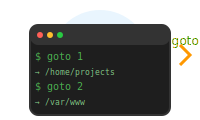

<p align="center">
  
</p>

<h1 align="center">gotoWorkspace</h1>

<p align="center">
  터미널에서 자주 가는 디렉토리를 번호로 관리하고 빠르게 이동하는 유틸리티
</p>

<p align="center">
  <a href="docs/CHANGELOG.md">
    
  </a>
  <a href="src/VERSION">
    
  </a>
  
  
  <a href="LICENSE">
    
  </a>
</p>

<p align="center">
  <a href="#-빠른-시작">빠른 시작</a> •
  <a href="#-주요-특징">특징</a> •
  <a href="docs/MANUAL.md">사용법</a> •
  <a href="docs/DESCRIPTION.md">상세 설명</a> •
  <a href="docs/CHANGELOG.md">변경사항</a>
</p>

---

## 🚀 빠른 시작

### 설치
```bash
./install.sh
```

### 기본 사용법
```bash
goto                    # 목록 보기
goto list add pwd       # 현재 위치 추가
goto 1                  # 1번 경로로 이동
goto select up 2        # 기본 위치를 2번으로 설정
```

## ✨ 주요 특징

| 기능 | 설명 |
|------|------|
| 🎯 **빠른 이동** | `goto 1`, `goto 2` 형태로 즉시 이동 |
| 🔧 **자동 설치** | bash/zsh 환경 자동 감지 및 설정 |
| 📂 **안정적** | `~/.gotoworkspace`에 설치되어 경로 문제 없음 |
| 🗑️ **완전 관리** | 설치/제거/업데이트 기능 지원 |
| 🌐 **크로스 플랫폼** | Linux/macOS 지원 |
| ⚡ **경량** | 의존성 없는 순수 bash 스크립트 |

## 📚 문서

<table>
  <tr>
    <td align="center">
      <a href="docs/MANUAL.md">
        
      </a>
      <br>
      <sub>모든 명령어 상세 가이드</sub>
    </td>
    <td align="center">
      <a href="docs/DESCRIPTION.md">
        
      </a>
      <br>
      <sub>프로젝트 소개 및 기술적 특징</sub>
    </td>
    <td align="center">
      <a href="docs/CHANGELOG.md">
        
      </a>
      <br>
      <sub>버전별 업데이트 내역</sub>
    </td>
  </tr>
</table>

## 🛠️ 요구사항

- **OS**: Linux, macOS
- **Shell**: bash 또는 zsh
- **Dependencies**: 기본 Unix 명령어 (sed, grep, awk)

## 🎥 데모

```bash
# 현재 프로젝트 디렉토리들 추가
goto list add /home/user/projects/frontend
goto list add /home/user/projects/backend  
goto list add /home/user/projects/mobile

# 빠른 이동
goto 1  # frontend로 이동
goto 2  # backend로 이동
goto 3  # mobile로 이동

# 기본 위치 설정
goto select up 1  # frontend를 기본으로 설정
goto root         # 기본 위치로 이동
```

## 🤝 기여하기

프로젝트에 기여하고 싶으시다면:

1. 이 저장소를 Fork
2. 새 브랜치 생성 (`git checkout -b feature/amazing-feature`)
3. 변경사항 커밋 (`git commit -m 'Add some amazing feature'`)
4. 브랜치에 Push (`git push origin feature/amazing-feature`)
5. Pull Request 생성

이슈 제기나 개선 제안도 언제든 환영합니다!

## 📄 라이센스

이 프로젝트는 [MIT 라이센스](LICENSE) 하에 배포됩니다.

---

<p align="center">
  Made with ❤️ by <a href="https://github.com/namugach">namugach</a>
</p>

<p align="center">
  <a href="https://github.com/namugach/gotoWorkspace">
    
  </a>
  <a href="https://github.com/namugach/gotoWorkspace">
    
  </a>
</p>
